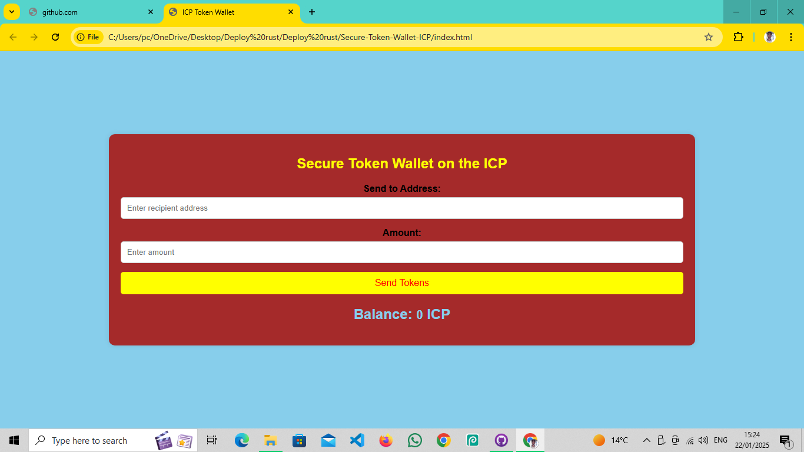

# Secure Token Wallet on ICP Blockchain

## Overview

This project is a **Secure Token Wallet** designed to interact with the **Internet Computer Protocol (ICP)** blockchain. The wallet allows users to store, send, and receive ICP or custom tokens in a secure and user-friendly manner. This implementation ensures a high level of security by encrypting sensitive data and incorporating secure authentication methods.

---

## Features

- **Token Storage**: Securely store ICP and custom tokens on the blockchain.
- **Send/Receive Tokens**: Seamlessly send and receive tokens between users.
- **Balance Tracking**: View current token balance within the wallet.
- **Transaction History**: Track transaction history and details.
- **Secure Authentication**: Implementations for secure login and transaction signing.
- **Cross-Platform Support**: Compatible with web applications, built with a responsive design.

---

## Tech Stack

- **Blockchain**: Internet Computer Protocol (ICP)
- **Smart Contracts**: Motoko (or Rust for advanced use cases)
- **Frontend**: React.js (or Vue.js, depending on the setup)
- **Backend**: Motoko or Rust Canisters for wallet functionality
- **Security**: AES encryption, HTTPS, decentralized identity for authentication

 <h3>index.html</h3>

